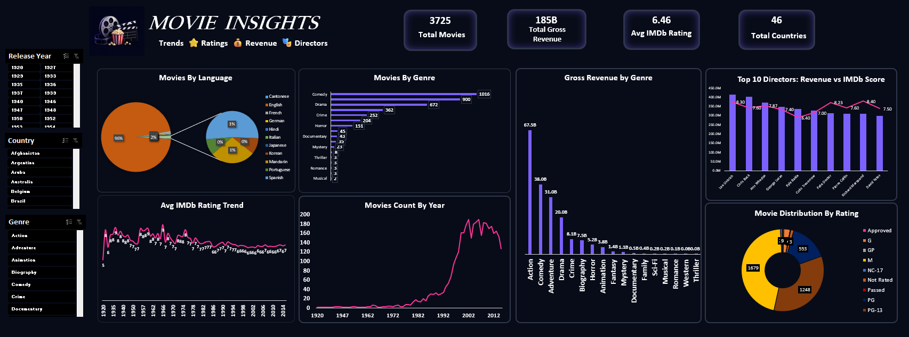

# Movie Data Analysis & Interactive Excel Dashboard

## Project Overview

This project analyzes **3,700+ movie records** using Microsoft Excel to identify trends and patterns across movie genres, languages, ratings, IMDb scores, revenue, directors, and release years.

An interactive Excel dashboard was created using **PivotTables, PivotCharts, and data visualization** to present the analysis in an easy-to-understand format.

## Project Objectives

* Analyze movie distribution across different genres.
* Compare gross revenue across movie genres.
* Analyze IMDb rating trends over the years.
* Explore movie distribution by language and rating.
* Analyze movie releases by year.
* Compare directors based on revenue and IMDb performance.
* Build an interactive dashboard to present key insights.

## Tools & Skills

* **Microsoft Excel**
* **PivotTables**
* **PivotCharts**
* **Data Cleaning**
* **Data Analysis**
* **Data Visualization**
* **Dashboard Development**

## Dataset

The dataset contains **3,700+ movie records** with information including:

* Movie Title
* Release Date
* Genre
* Language
* Country
* Rating
* Lead Actor
* Director
* IMDb Score
* Total Reviews
* Movie Duration
* Gross Revenue
* Budget
* Release Year

## Analysis Performed

### Movies by Genre

Analyzed the number of movies across different genres to understand the distribution of movies by category.

### Gross Revenue by Genre

Compared gross revenue across movie genres to identify commercially strong categories.

### IMDb Rating Analysis

Analyzed average IMDb ratings across different release years to identify rating trends over time.

### Movies by Language

Explored the distribution of movies across different languages.

### Movies by Release Year

Analyzed the number of movies released over different years to identify production trends.

### Director Analysis

Compared directors based on movie revenue and IMDb scores.

### Movie Rating Distribution

Analyzed the distribution of movies across different content ratings.

## Dashboard

The Excel dashboard combines multiple analyses and visualizations to provide an overview of movie trends and performance.

### Dashboard Preview



## Key Insights

- Analyzed **3,725 movies** across multiple genres, languages, countries, and ratings.
- The dataset covers movies from **46 countries**, providing a broad view of international movie production.
- The overall average IMDb rating across the dataset is **6.46**.
- Total gross revenue across the analyzed movies is approximately **185B**.
- Identified genre-wise differences in movie volume and gross revenue.
- Observed changes in movie production volume and average IMDb ratings across release years.

## Project Files

```text
Movie-Data-Analysis-Excel-Dashboard/
│
├── Movie_Data_Dashboard.xlsx
├── README.md
└── screenshots/
    └── dashboard.png
```

## Skills Demonstrated

This project demonstrates practical experience in:

* Data Analysis
* Microsoft Excel
* Data Visualization
* Dashboard Creation
* PivotTables
* PivotCharts
* Exploratory Data Analysis
* Business Insights

## 👤 Author

Gayatri Shinde

Aspiring Data Analyst | Excel | Power BI | Data Analytics

